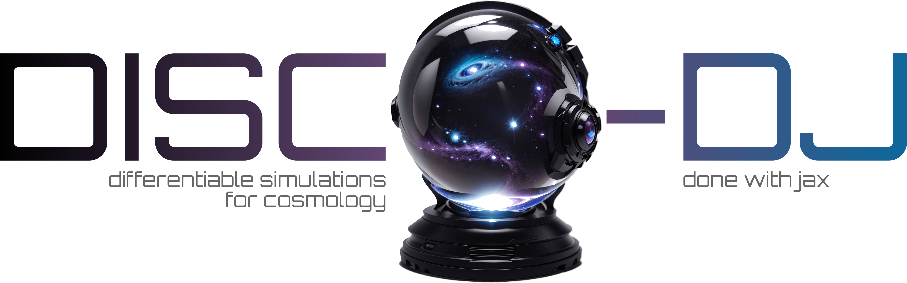

# DISCO-DJ: DIfferentiable Simulations for COsmology - Done with Jax


This is a Python3 package for ND (N = 1, 2, 3) **large-scale-structure** (LSS) cosmology. Most of the algorithms are written in **Jax** and therefore differentiable. Disco-DJ runs on **GPUs** (much faster and highly recommended!) or CPUs.

Disco-DJ includes

 *  an **Einstein-Boltzmann** code (hosted externally here: https://github.com/ohahn/DISCO-EB)
 *  the **nLPT** (n-th order Lagrangian perturbation theory) recursion relations at arbitrary order
 *  semi-classical **propagator pertubation theory** (PPT) in Jax
 *  a fast **particle-mesh N-body code**, featuring
    * fast *theory-informed time integrators* (BullFrog, FastPM, ...)
    * many *discreteness-suppression techniques* (de-aliasing, sheet-based resampling, higher-order mass assingment kernels, ...)
    * memory-saving reverse-mode differentiation via the *adjoint method*
 *  a (non-differentiable) **Tree-PM** N-body code, with the QTree part written in multi-threaded C++17, exposed via pybind11
 *  **analysis methods** (power spectrum, cross-spectrum, bi-spectrum, etc.)
 *  **forward and reverse-mode** automatic differentiation
 *  N-GenIC IC generation
 *  reading/writing Gadget4 and SWIFT snapshots


## Requirements:
All required dependencies will be automatically instealled when installing Disco-DJ as explained below:
 * `jax` and `jaxlib` are required in order to use Disco-DJ (see https://jax.readthedocs.io/en/latest/installation.html#installation).  
 *  `pybind11` is required (see https://pybind11.readthedocs.io/en/latest/installing.html; in case of errors when installing Disco-DJ, try manually installing`pybind11-global`).
 * `einops` 
 * `diffrax`

Disco-DJ has been tested with Jax/Jaxlib version 0.7.2
and Diffrax version 0.7.0.

Note that the Disco-DJ installation installs `jax` and `jaxlib` without GPU support by default. 
If you want to use Disco-DJ with a GPU, [follow the JAX docs](https://docs.jax.dev/en/latest/installation.html#installation)
to install the GPU version of `jax`.


### Optional dependencies
   * `pywavelets` (for wavelet-based generation of Gaussian random fields)
   * `h5py` (for saving particle data to HDF5 files)
   * `pylians` (for reading gadget files)
   * `tqdm` (for reading gadget files)

## Quickstart:
```python
from discodj import DiscoDJ
dj = DiscoDJ(dim=3, res=256, boxsize=100.0)
dj = dj.with_timetables()
dj = dj.with_linear_ps()
dj = dj.with_ics()
dj = dj.with_lpt(n_order=1)
X, P, a = dj.run_nbody(a_ini=0.02, a_end=1.0, n_steps=10, res_pm=512, stepper="bullfrog")
```
Please see the notebooks for more detailed examples.

You can also run a quick demo from the commandline:
```bash
discodj_demo --help
# or if you cloned this repository
python demo.py --help
```

## Installation:
### Install with 

```bash
pip install git+https://github.com/cosmo-sims/DISCO-DJ.git
```
If you want to edit the source code, you can clone this repository and install Disco-DJ in editable mode with 

```bash
pip install -e .
```

If you want to install all optional dependencies, you can use
```bash
pip install ".[all]"
```

To use DISCO-DJ with a GPU (highly recommended!), [follow the JAX docs](https://docs.jax.dev/en/latest/installation.html#installation):

```
pip install -U "jax[cuda13]" # or "jax[cuda12]"
```

### Troubleshooting:
#### - pybind11 not found
If you get the following message
```
CMake Error at CMakeLists.txt:27 (FIND_PACKAGE):
By not providing "Findpybind11.cmake" in CMAKE_MODULE_PATH this project has
asked CMake to find a package configuration file provided by "pybind11",
but CMake did not find one.

Could not find a package configuration file provided by "pybind11" with any
of the following names:

 pybind11Config.cmake
 pybind11-config.cmake

Add the installation prefix of "pybind11" to CMAKE_PREFIX_PATH or set
"pybind11_DIR" to a directory containing one of the above files.  If
"pybind11" provides a separate development package or SDK, be sure it has
been installed.
```
try making a global pybind11 install as follows
```bash
pip install "pybind11[global]"
```

#### - IDE visibility of Disco-DJ internals
If you encounter the problem of your IDE (e.g. PyCharm, VSCode, Spyder, etc.) not being able to "look inside" `DiscoDJ`
(i.e., it doesn't propose / autocomplete function names, parameters, etc.), try a "strict" editable install 
(https://setuptools.pypa.io/en/latest/userguide/development_mode.html#strict-editable-installs) with

```bash
pip install -e . --config-settings editable_mode=strict
```

##### - `CMAKE_CXX_COMPILER not set` or `Could NOT find GSL`

DISCO-DJ requires a C++ compiler and GSL to compile some parts of it (NGENIC ICs and Tree-PM). On a Ubuntu/Debian this should be enough to install:

```bash
sudo apt install build-essential libgsl-dev libpython3-dev
```

### List of papers that use Disco-DJ
  *  List, F. and Hahn, O., *Perturbation-theory informed integrators for cosmological simulations*, JCP 113201, 2024, [arXiv:2301.09655](https://arxiv.org/abs/2301.09655)
  *  List, F., Hahn, O., Rampf, C., *Starting Cosmological Simulations from the Big Bang*, Phys. Rev. Lett. 132.13, 131003, 2024, [arXiv:2309.10865](https://arxiv.org/abs/2309.10865)
  *  Schanz, A., List, F., Hahn, O., *Stochastic Super-resolution of Cosmological Simulations with Denoising Diffusion Models*, OJA 7 (November), 2024, [arXiv:2310.06929](https://arxiv.org/abs/2310.06929)
  *  Rampf, C., List, F., Hahn, O., *BullFrog: Multi-step perturbation theory as a time integrator for cosmological simulations*, JCAP 02 (2025) 020, 2025, [arXiv:2409.19049](https://arxiv.org/abs/2409.19049)
  *  Buisman, J., List, F., Hahn, O., *Differentiable Halo Mass Prediction and the Cosmology-Dependence of Halo Mass Functions*, Preprint [arXiv:2507.03074](https://arxiv.org/abs/2507.03074)
