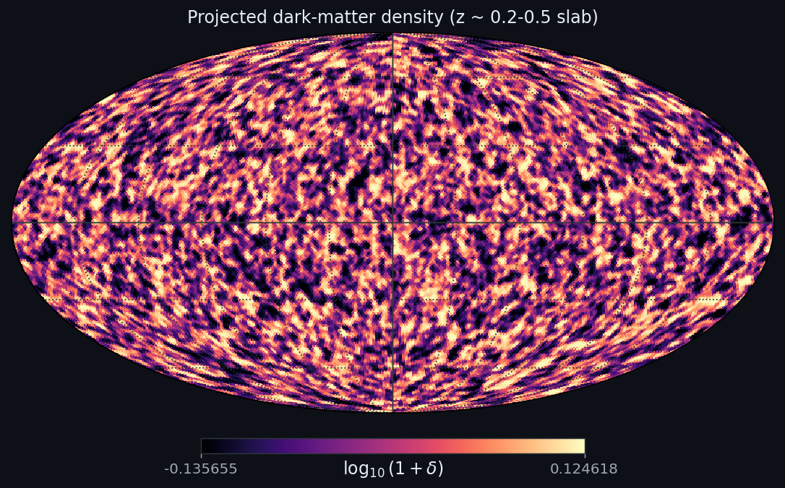
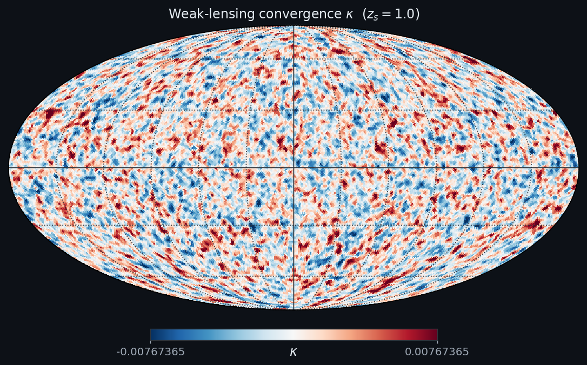
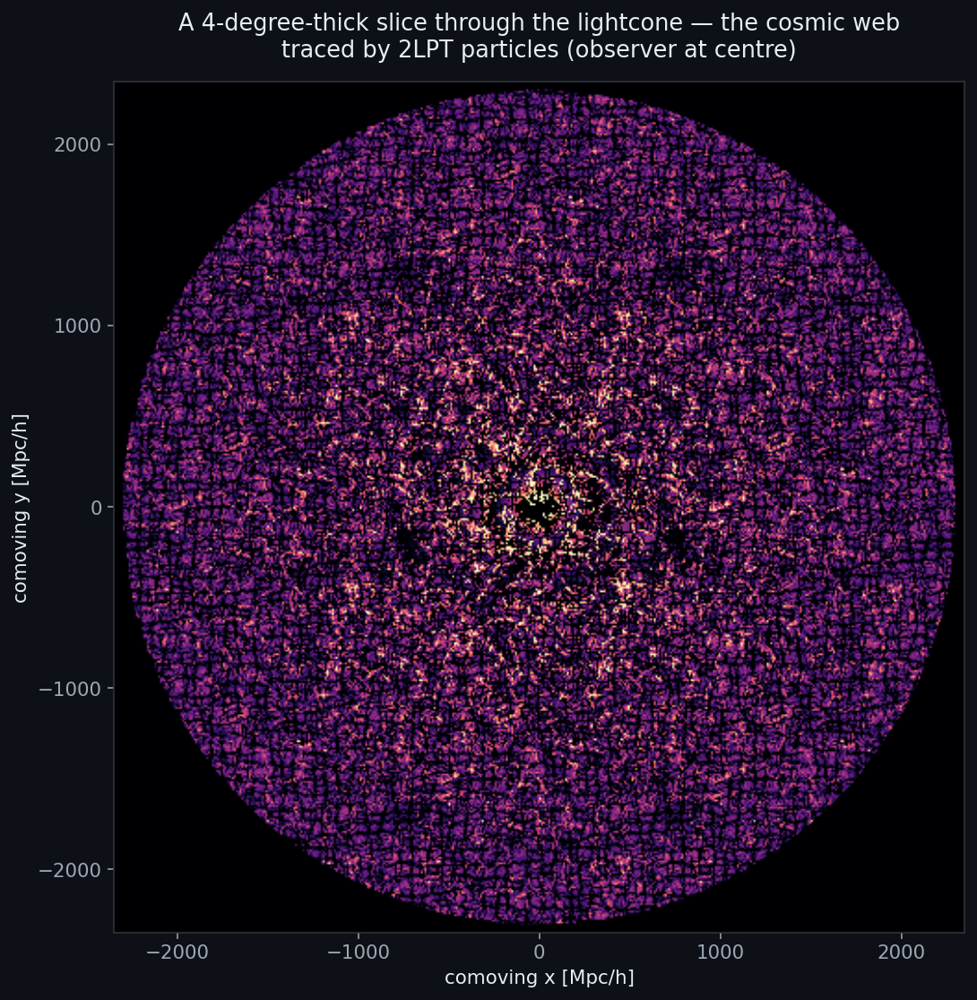
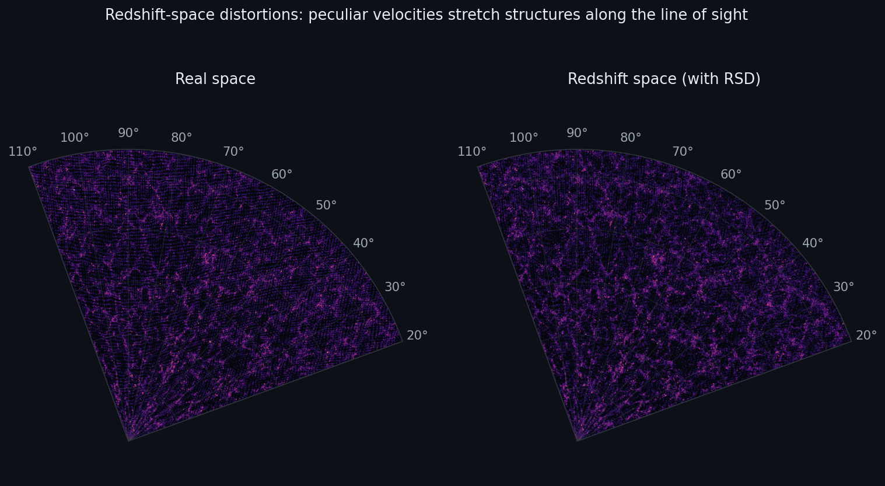
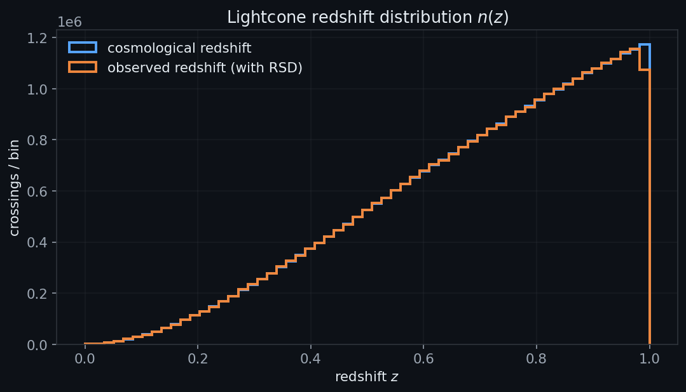

# DiscoDJ lightcone integration guide

This document describes the lightcone-catalogue surface of
[DiscoDJ](https://github.com/cosmo-sims/DISCO-DJ) — what it produces, the
on-disk format, the physical conventions, and the small API another
pipeline needs to consume the catalogues, generate new ones, or refresh
existing ones at a perturbed cosmology.

DiscoDJ is broader than this: 1-D / 2-D / 3-D Lagrangian perturbation
theory, particle-mesh + Tree-PM N-body, an Einstein–Boltzmann solver, and
analysis tools (P(k), bispectrum, cross-spectrum) — all in JAX, all
differentiable. This guide stays focused on the 2-LPT past-lightcone path
that the observational-modeling pipeline will consume.

---

## 0. Gallery — one lightcone, many products

Every panel below comes from a **single** differentiable 2-LPT past-lightcone
(128³ particles, 1500 Mpc/h box, Planck18 — 32 M crossings) generated and
rendered by [`make_lightcone_gallery.py`](make_lightcone_gallery.py). The same
pipeline scales to 1024³ and refreshes across cosmologies for Fisher / inference
work. **▶ Open the interactive gallery: [`lightcone_gallery.html`](lightcone_gallery.html)**
(drag-to-rotate 3-D view + full-resolution figures).

#### Smooth fields

| Projected DM density (z ≈ 0.2–0.5 slab) | Weak-lensing convergence κ (Born, z_s = 1) |
|---|---|
|  |  |

Mass painted onto a HEALPix sky from the lightcone shells, and the Born-approx
convergence from the overdensity shells — both pure-JAX, so `∂C_ℓ/∂θ` flows
straight back to cosmology.

#### The cosmic web & catalogues



*A 4°-thick slice through the lightcone (observer at centre) — filaments, knots
and voids straight from the 2-LPT particle catalogue.*

| Redshift-space distortions | Redshift distribution n(z) |
|---|---|
|  |  |

The same structures in real vs redshift space (peculiar velocities stretch them
along the line of sight), and the cosmological-vs-observed redshift distribution.

> Regenerate everything with `python docs/make_lightcone_gallery.py` (needs the
> `discodj[sky]` extra plus `matplotlib healpy plotly`).

---

## 1. Quick start

End-to-end: build a 512³ scene, write a lightcone, read it back.

```python
import numpy as np
from discodj import DiscoDJ
from discodj.core.io import read_lightcone_header
import h5py

L = 3468.0          # Mpc/h
N = 512
a_far, a_near = 0.25, 2.0 / 3.0    # z ≈ 3 -> z ≈ 0.5
observer = np.array([L / 2] * 3)

dj = (DiscoDJ(dim=3, res=N, boxsize=L, cosmo="Planck18EEBAOSN")
        .with_timetables()
        .with_linear_ps()
        .with_ics(seed=42)
        .with_lpt(n_order=2))

summary = dj.evaluate_lpt_lightcone_to_hdf5(
    "/tmp/lc.h5",
    a_far=a_far, a_near=a_near, n_shells=128,
    observer=observer,
    n_part_chunks=8, n_newton_iters=1,
    keep_particle_idx=True,        # *required* if you'll refresh later
    v_mode="radial",                # 1-D radial v; pass 'full' for 3-D
    compression="zstd",
    verbose=True,
)
print(summary)   # {"n_particles": ~1.13e9, "n_replicas": 27}

# Read it back
meta = read_lightcone_header("/tmp/lc.h5")
with h5py.File("/tmp/lc.h5", "r") as f:
    x  = f["PartType1/Coordinates"][:]
    vr = f["PartType1/RadialVelocity"][:]
    a  = f["PartType1/ScaleFactor"][:]
print(meta["n_particles"], x.shape, vr.shape, a.shape)
```

> **Important:** *always* import `discodj.core.io` (directly or transitively
> via `discodj`) **before** opening any HDF5 file. That import registers
> the `hdf5plugin` filter path so HDF5 can decode the Blosc-zstd chunks the
> catalogues use, and sets `BLOSC_NTHREADS=os.cpu_count()` so reads / writes
> multi-thread.

---

## 2. On-disk schema

### 2.1 `/Header` attributes

| Name | Type | Meaning |
|---|---|---|
| `LightconeMode` | int | 1 (marks the file as a past-lightcone catalogue) |
| `Observer` | (3,) float64 | Observer position in box coords, Mpc/h |
| `BoxSize` | float | Simulation box edge length, Mpc/h |
| `Omega0` | float | Ω<sub>m</sub> of the cosmology used to write this file |
| `OmegaLambda` | float | Ω<sub>Λ</sub> ≡ Ω<sub>de</sub> |
| `HubbleParam` | float | h (with H₀ = 100 h km/s/Mpc) |
| `MassTable` | (6,) float64 | Per-particle mass per Gadget type; only entry 1 (DM) is non-zero |
| `NumPart_ThisFile` | (6,) uint32 | Low 32 bits of the per-type row counts |
| `NumPart_Total` | (6,) uint32 | Same; only one file written |
| `NumPart_Total_HighWord` | (6,) uint32 | **High 32 bits** of the per-type counts. Needed for >2³² rows (typical at N≥1024) |
| `NumPart_PerReplica` | int | N³, the *Lagrangian* particle count of one box (before replication and before the multi-shell crossings of each particle) |
| `NumFilesPerSnapshot` | int | 1 |
| `Time` | float | 1.0 — not meaningful for a lightcone catalogue |
| `RefreshMode` | str | (only present in files produced by `refresh_lightcone_cosmology`) the mode used, `"fixed_psi"` or `"exact"` |

Total row count, robustly:

```python
low  = meta["NumPart_Total"][1]
high = meta["NumPart_Total_HighWord"][1]
M    = int(low) + (int(high) << 32)
```

…or use `read_lightcone_header(path)["n_particles"]`, which already does this for you.

### 2.2 `/PartType1` datasets

All datasets share the same leading axis `M` = total number of crossings.

| Name | Shape | Dtype | Always written | Description |
|---|---|---|---|---|
| `Coordinates` | (M, 3) | float32 | ✓ | Position of the crossing in box coords, with the replica offset applied. Mpc/h, **un-wrapped** (no periodic wrap) — see §3. |
| `Velocities` | (M, 3) | float32 | ✓ if `v_mode='full'` | Full 3-D velocity in Gadget convention (§3). |
| `RadialVelocity` | (M,) | float32 | ✓ if `v_mode='radial'` (new default) | Line-of-sight component, same Gadget convention. |
| `ScaleFactor` | (M,) | float32 | ✓ | Per-row crossing scale factor `a_cross ∈ [a_far, a_near]`. |
| `ParticleIDs` | (M,) | uint64 | ✓ | Sequential row index 0 … M−1 (Gadget convention). **Not** the Lagrangian particle index. |
| `Masses` | (M,) | float32 | ✓ | Uniform per-row mass in 10¹⁰ M☉/h. |
| `ReplicaIndex` | (M,) | int16 | ✓ | Index into the list of periodic-box replicas used; one row per (particle, replica) crossing. |
| `ShellIndex` | (M,) | int16 | ✓ | Index of the shell `[a_k, a_{k+1}]` in which `a_cross` lies. |
| `LagrangianParticleIndex` | (M,) | int32 | optional | Per-row index into the Lagrangian q-grid `[0, N³)`. Written iff `keep_particle_idx=True`. **This is the field you want for particle traceability across cosmologies.** |

A particle can contribute *multiple* rows (different replicas, occasionally
two distinct shell crossings of one trajectory) — the row count usually
exceeds N³.

---

## 3. Physical conventions

Three things downstream pipelines most often miss.

**Positions.** `Coordinates` are *comoving* Mpc/h in the *box* frame, with
each particle's replica offset *r · L* added. They are **not periodic**:
two rows for the same Lagrangian particle in two different replicas have
different `Coordinates`. The comoving distance to the observer is just

```python
d = np.linalg.norm(x - meta["Observer"], axis=-1)
```

and at the row's `a_cross` it satisfies `d ≈ χ(a_cross)` to fp32 ulp (≲
10⁻⁵ relative), where χ is the comoving-distance integral of the
file's cosmology.

**Velocities.** Internally DiscoDJ carries `v = dΨ/dτ_sc` — derivative
of the Lagrangian displacement with respect to *super-conformal* time.
The writer applies the Gadget convention,

```
v_g = v · (100 / a_cross^1.5)
```

so the stored `Velocities` / `RadialVelocity` is **Gadget velocity in
km/s, √a-scaled**. The standard reader convention is to divide by
`√a` to get the peculiar velocity in km/s:

```python
v_pec_kms = v_g / np.sqrt(a)            # km/s peculiar
```

For `v_mode='radial'` the stored scalar is `(v_g · n̂)` where
`n̂ = (x − observer) / |x − observer|`. **Sign convention: positive =
receding** (positive cosmological redshift).

**IDs.** `ParticleIDs` is just `arange(M)` — it identifies a *row* in
this file, not a particle. To trace the same dark-matter particle across
cosmologies (e.g. for refresh-based parameter sweeps), pass
`keep_particle_idx=True` when generating, then use
`LagrangianParticleIndex` (range `[0, N³)`) combined with `ReplicaIndex`
as the unique key.

---

## 4. Reader recipes

There is intentionally **no full-catalogue loader** in DiscoDJ — h5py is
already the right tool and any wrapper would just hide things.

**Header only** (cheap, useful for routing logic):

```python
from discodj.core.io import read_lightcone_header
meta = read_lightcone_header("/path/lc.h5")
# extra fields beyond raw attrs:
#   meta["n_particles"]       int   (handles HighWord)
#   meta["v_mode"]            "radial" | "full" | None
#   meta["has_particle_idx"]  bool
```

**Whole catalogue** (fits in RAM):

```python
import h5py
with h5py.File("/path/lc.h5", "r") as f:
    g = f["PartType1"]
    x   = g["Coordinates"][:]
    vr  = g["RadialVelocity"][:]              # or g["Velocities"][:]
    a   = g["ScaleFactor"][:]
    rep = g["ReplicaIndex"][:]
    sh  = g["ShellIndex"][:]
    lpid = g["LagrangianParticleIndex"][:]    # if keep_particle_idx
    obs = f["Header"].attrs["Observer"]
    h   = f["Header"].attrs["HubbleParam"]
```

**Batched** (catalogue too big for RAM — typical at N≥1024):

```python
import h5py
batch = 1 << 21   # 2M rows
with h5py.File("/path/lc.h5", "r") as f:
    g = f["PartType1"]; M = g["Coordinates"].shape[0]
    for start in range(0, M, batch):
        end = min(start + batch, M)
        x_chunk  = g["Coordinates"][start:end]
        vr_chunk = g["RadialVelocity"][start:end]
        a_chunk  = g["ScaleFactor"][start:end]
        # ... process ...
```

**Comoving-distance binning**:

```python
import jax.numpy as jnp
from discodj.cosmology.cosmology import Cosmology
cosmo = Cosmology(Omega_c=0.26, Omega_b=0.049, h=0.678,
                  sigma8=0.81, n_s=0.97).compute_timetables(None)
chi = np.asarray(cosmo.chi(jnp.asarray(a)))         # comoving distance
# or just use d = |x - observer|, which matches chi(a) to fp32 ulp.
```

---

## 5. Generating a fresh lightcone

The full call:

```python
summary = dj.evaluate_lpt_lightcone_to_hdf5(
    output_path="/path/lc.h5",
    a_far=0.25, a_near=2/3,        # survey scale-factor range
    n_shells=128,                   # log-spaced shells in a
    observer=[L/2, L/2, L/2],
    n_order=None,                   # default: highest LPT computed
    n_part_chunks=8,                # memory/throughput dial; see below
    n_newton_iters=1,               # 1 = fp32 ulp at n_shells>=128
    keep_particle_idx=True,         # write LagrangianParticleIndex
    v_mode="radial",                # "radial" (scalar) or "full" (3-vec)
    radial_residual_tol=1e-1,       # Mpc/h — Newton-residual filter
    compression="zstd",             # default; multi-threaded Blosc-zstd
    storage_chunk_rows=1 << 20,     # 1M-row HDF5 chunks
    verbose=True,
)
```

Key knobs:

- **`n_part_chunks`**: streams the Lagrangian particles in this many
  passes. `n_part_chunks=1` keeps the full `(N³, 3)` arrays alive — only
  fits at N≤256 on a 32 GB host. `n_part_chunks=8` at N=512 peaks around
  ~16 GB; at N=1024 you want `n_part_chunks=16`.
- **`n_newton_iters=1`** is the production default. At `n_shells ≥ 128`
  the secant seed is already within 10⁻⁵ of the root, and one Newton
  iteration drives `|d − χ(a_cross)|` to fp32 ulp. Higher counts cost
  proportionally more wall time and don't improve fp32 accuracy.
- **`keep_particle_idx=True`** is *required* if you plan to refresh the
  catalogue at a different cosmology. There's no way to reconstruct it
  later.
- **`v_mode='radial'`** saves 8 B/row (no information loss for
  redshift-space / kSZ analyses). Use `'full'` if you need transverse
  components.
- **`compression='zstd'`** maps to multi-threaded Blosc-zstd (~3× faster
  than single-thread zstd at the same ratio). Alternatives:
  `'lz4'` (faster, larger), `'blosc2'` (Blosc2 instead of v1, slightly
  smaller, slower), `'zstd_serial'` (legacy single-thread zstd), `None`
  (no compression — ~2× file size, fastest write).

There is also a *streaming* variant that returns numpy arrays in memory:

```python
out = dj.evaluate_lpt_lightcone(
    a_far=0.25, a_near=2/3, n_shells=128, observer=observer,
    streaming=True, n_part_chunks=8, n_newton_iters=1,
    radial_sort=True, keep_particle_idx=True, v_mode="radial")
# out["x"], out["v_radial"], out["a_cross"], out["replica_idx"],
# out["shell_idx"], out["particle_idx"]
```

Use this only if the catalogue fits in RAM; for production catalogues
prefer `evaluate_lpt_lightcone_to_hdf5` so memory is bounded.

---

## 6. Refreshing a lightcone at a new cosmology

When sweeping cosmological parameters you don't need to re-run the
expensive 2-LPT pipeline. DiscoDJ can persist the *scene* — the
displacement fields plus enough metadata to regenerate the white noise —
and then refresh a catalogue at any other cosmology much faster than a
from-scratch run.

**One-time save** (after `with_lpt(...)`):

```python
dj.save_lpt_scene(
    "/path/scene.h5",
    include_psi=True,                        # required for fixed_psi mode
    ic_params=dict(seed=42),                 # match what you passed to with_ics
)
```

Scene file size ≈ 3 × N³ × 4 B before compression (~3 GB at N=512,
~26 GB at N=1024); Blosc-zstd halves that.

**Refresh** (file → file):

```python
from discodj import DiscoDJ
from discodj.cosmology.cosmology import Cosmology

new_cosmo = Cosmology(
    Omega_c=0.26, Omega_b=0.049, h=0.678, sigma8=0.81, n_s=0.97,
    Omega_k=0.0, w0=-1.05, wa=0.05,
).compute_timetables(None)

result = DiscoDJ.refresh_lightcone_cosmology(
    scene_path        = "/path/scene.h5",
    input_lightcone   = "/path/lc_fid.h5",
    output_lightcone  = "/path/lc_new.h5",
    new_cosmology     = new_cosmo,
    mode              = "fixed_psi",   # or "exact"
    sigma8_rescale    = True,          # closed-form σ8 rescale of Ψ
    n_newton_iters    = 1,
    compression       = "zstd",
    verbose           = True,
)
# result = {"n_particles_in", "n_particles_out", "n_replicas", "mode"}
```

**`mode='fixed_psi'` (default).** Reuses the persisted Ψ₁, Ψ₂ verbatim
and only re-evaluates `D_n(a)` and χ(a) at the new cosmology. Exact for
parameter changes that don't touch the transfer function T(k):

- `w0`, `wa` (dark-energy equation of state)
- growth-only Ω<sub>de</sub> tweaks

For changes that *do* touch T(k) — Ω<sub>m</sub>, Ω<sub>b</sub>, *n<sub>s</sub>*,
σ₈ — `fixed_psi` is a controlled approximation. The σ₈-only special
case is exact (closed-form Ψ rescale by σ₈<sub>new</sub>/σ₈<sub>fid</sub>,
gated by `sigma8_rescale=True`). Empirically the bias for ~percent
shifts in the other params is in the per-mille range on `a_cross` — fine
for most cosmological-parameter Fisher / MCMC steps, worth checking for
your specific application by comparing against `mode='exact'` once.

**`mode='exact'`.** Regenerates the white noise from the saved seed at
the new cosmology (deterministic — same `jax.random.PRNGKey(seed)`),
multiplies by `sqrt(P(k; θ_new))`, recomputes Ψ₁, Ψ₂, then Newton-refines
each crossing. Exact for any cosmology change. Costs roughly the same as
a fresh run minus the chi_to_a seed search and residual filter.

**Performance.** Measured on a 128 GB Mac (18 cores), 2-LPT, N=512,
n_part_chunks=8:

| Operation | Wall time |
|---|---|
| fresh `evaluate_lpt_lightcone_to_hdf5` @ fiducial | 153 s |
| `save_lpt_scene` (one-time) | 4 s |
| **`refresh_lightcone_cosmology(mode='fixed_psi')`** | **60 s** |
| `refresh_lightcone_cosmology(mode='exact')` | ~140 s |
| fresh @ perturbed cosmology (for reference) | 164 s |

For a sweep over *K* cosmologies: one fresh + *K* refreshes ≈
(153 + 60·K) s vs. (164·K) s if every step were fresh — ~2.7× speedup
at *K* = 10, asymptoting to the fixed_psi-vs-fresh ratio for large *K*.

Match semantics: refresh always emits a subset of the input lightcone
rows. A row drops out iff its Newton-refined a leaves `[a_far, a_near]`
or its residual exceeds `radial_residual_tol`. For typical sub-percent
parameter shifts, ≲ 1 % of rows drop. The `LagrangianParticleIndex` and
`ReplicaIndex` are preserved, so matched-row comparisons across
cosmologies are straightforward.

---

## 7. In-memory autodiff entry point

For Fisher / JVP / gradient-based inference, use the pure-JAX
`refresh_lightcone_arrays`:

```python
import jax, jax.numpy as jnp
from discodj.cosmology.cosmology import Cosmology
from discodj.lpt.lightcone_refresh import (
    refresh_lightcone_arrays, load_lpt_scene, load_refresh_inputs)
from discodj.lpt.lightcone import enumerate_replicas
import numpy as np

scene  = load_lpt_scene("/path/scene.h5", load_psi=True)
inputs = load_refresh_inputs("/path/lc_fid.h5")
hdr    = inputs["header"]

# Survey geometry from the input lightcone header.
observer = jnp.asarray(hdr["Observer"], dtype=jnp.float32)
L        = scene["boxsize"]
a_far, a_near = 0.25, 2/3
a_shells = jnp.asarray(np.geomspace(a_far, a_near, 129), dtype=jnp.float32)

# Lagrangian grid (cheap to rebuild from res + boxsize):
N = scene["res"]; dx = L / N
axes = [np.arange(N, dtype=np.float32) * dx] * 3
q_flat = jnp.asarray(
    np.stack(np.meshgrid(*axes, indexing="ij"), axis=-1).reshape(-1, 3))

psi_1 = jnp.asarray(scene["psi_1"].reshape(-1, 3))
psi_2 = jnp.asarray(scene["psi_2"].reshape(-1, 3))

# Replica offsets: derive from chi range at the fiducial cosmology; the set
# is stable under small parameter perturbations.
cosmo_fid = Cosmology(**scene["cosmology_params"]).compute_timetables(None)
chi_far  = float(cosmo_fid.chi(jnp.asarray(a_far)))
chi_near = float(cosmo_fid.chi(jnp.asarray(a_near)))
reps = enumerate_replicas(L, np.asarray(observer), chi_near, chi_far)
replica_offsets = jnp.asarray(reps, dtype=jnp.float32) * L

pid = jnp.asarray(inputs["particle_idx"], dtype=jnp.int32)
rep = jnp.asarray(inputs["replica_idx"],  dtype=jnp.int32)
a0  = jnp.asarray(inputs["a_cross"],      dtype=jnp.float32)

def f(w0):
    cosmo = Cosmology(**{**scene["cosmology_params"], "w0": w0}).compute_timetables(None)
    out = refresh_lightcone_arrays(
        pid, rep, a0,
        q_flat, (psi_1, psi_2),
        replica_offsets, observer, a_shells, cosmo,
        a_far=a_far, a_near=a_near,
        n_newton_iters=1, v_mode="radial",
    )
    # out: {"x": (M,3), "v_radial": (M,), "a_cross": (M,),
    #       "shell_idx": (M,), "valid": (M,) bool}
    return out["a_cross"]

# Jacobian–vector product w.r.t. w0
primal, tangent = jax.jvp(
    f, (jnp.float32(-1.0),), (jnp.float32(1.0),))
# tangent[i] = ∂a_cross[i] / ∂w0  at w0 = -1
```

Notes:

- The kernel is jit'd internally and treats `new_cosmology` through plain
  JAX arrays extracted via `_cosmo_kernel_args` — the Cosmology PyTree is
  *not* passed directly because its `tree_flatten` stores the
  `_timetables` dict in *aux_data*, which JAX compares by Python equality
  across cached JITs (and array equality is ambiguous). So you can build
  the cosmology with traced parameters and `jax.grad` / `jax.jvp` /
  `jax.jacfwd` over it.
- JVP matches finite difference to ~10⁻³ relative on interior rows
  (limit set by FD truncation, not the gradient).
- At the `[a_far, a_near]` clip boundary the JVP correctly returns the
  zero subgradient; FD picks up a finite ±ε difference. If you need
  smooth derivatives near the boundary, push `a_far` slightly past your
  analysis window or filter out near-boundary rows.

---

## 8. Cosmology presets and custom cosmologies

Pass any of the following strings as `cosmo=...` to `DiscoDJ(...)`:

| Name | Origin |
|---|---|
| `"Planck15"` | Planck 2015 XIII Table 4 best-fit (TT+lowP+lensing) |
| `"Planck18EEBAOSN"` (default) | Planck 2018 EE+BAO+SN |
| `"CamelsCV"` | CAMELS central value |
| `"Quijote"` | Quijote fiducial |

…or pass an explicit dict / `Cosmology(...)` instance with the eight
free parameters `Omega_c`, `Omega_b`, `h`, `sigma8`, `n_s`, `Omega_k`,
`w0`, `wa`. The dict form is what gets persisted in the scene file under
`/Header/cosmo_*` attrs (see `discodj.lpt.lightcone_refresh.load_lpt_scene`).

The linear power spectrum can be built with any of three transfer-function
backends — `"Eisenstein-Hu"` (default, fitting formula),
`"BBKS"` (fitting formula), or `"DiscoEB"` (the on-board Einstein–Boltzmann
solver, when you need percent accuracy). Choose at `with_linear_ps(...)`
time. **The scene file records the chosen transfer function** so
`mode='exact'` refreshes use the same backend.

---

## 9. Performance and memory at scale

Observed on a 128 GB Apple-Silicon Mac, 18 physical cores, 2-LPT,
n_part_chunks chosen to stay comfortable in RAM. The incremental-HDF5
writer interleaves the radial kernel with the HDF5 append, so the
"streaming + HDF5" row reports the combined wall time:

| N | n_part_chunks | 2LPT compute | streaming + HDF5 | total |
|---|---|---|---|---|
| 128³ | 2 | 0.5 s | ~2 s | ~3 s |
| 256³ | 8 | 3 s | ~13 s | ~17 s |
| 512³ | 8 | 6 s | ~130 s | **~140 s** |
| 1024³ | 16 | 340 s | 1953 s | **38 min** |

(N=1024 is the practical ceiling on 128 GB — both 2-LPT working memory
and the catalogue grow as N³; peak RSS during the 1024³ run was 32 GB.)

Catalogue sizes (radial-velocity layout, Blosc-zstd compression, observed):

| N | crossings | raw catalogue | compressed file |
|---|---|---|---|
| 256³ | 0.14 G | 4 GB | 1.8 GB |
| 512³ | 1.13 G | 32 GB | 13–15 GB |
| 1024³ | **9.02 G** | 252 GB | **113.8 GB** |

---

## 9b. Extended capabilities

These build on the catalogue above; all the HEALPix / sky math is pure JAX, so
maps and convergence stay differentiable for Fisher / gradient work. The extra
runtime dependencies (`astropy`, `pyarrow`) come from the `discodj[sky]` extra;
HEALPix itself needs **no** dependency.

### Sky projection & masks (`discodj.lpt.sky`)

```python
from discodj.lpt.sky import cartesian_to_sky, sky_mask, add_sky_columns
sky = cartesian_to_sky(x, observer, cosmo, v_radial=vr, with_rsd=True)
# sky: {"ra","dec","z_cosmo","z_obs","chi"}  (RA∈[0,360), Dec∈[-90,90] deg)
keep = sky_mask(sky["ra"], sky["dec"], sky["z_obs"],
                healpix_mask=mask, z_range=(0.1, 1.2))
add_sky_columns("/path/lc.h5", with_rsd=True)   # append RA/Dec/Redshift[/RSD] in place
```
RSD uses the stored Gadget √a velocity: `v_pec = v_radial/√a`,
`z_obs = (1+z_cosmo)(1 + v_pec/c) − 1` (positive = receding).

### HEALPix shell maps & Born convergence (`discodj.lpt.lightcone_maps`)

```python
from discodj.lpt.lightcone_maps import (MapSpec, accumulate_shell_maps,
    shells_to_overdensity, density_shells_to_kappa)
spec = MapSpec(nside=512, a_edges=np.geomspace(0.25, 2/3, 33), weighted=True)
# on-the-fly during generation (no second pass, particle file optional):
summary = dj.evaluate_lpt_lightcone_to_hdf5("/path/lc.h5", ..., map_spec=spec)
maps = summary["maps"]                       # (n_bins, npix), also in /Maps/ShellMaps
delta = shells_to_overdensity(maps)
kappa = density_shells_to_kappa(delta, spec.a_edges, cosmo, z_source=1.0)
```
`ang2pix_ring` matches `healpy.ang2pix` exactly. With multiple observers the
stack is `(n_obs, n_bins, npix)`.

### Deformation / tidal / velocity-gradient columns (`deformation_mode`)

Per-row tensors evaluated from LPT at each crossing's refined `a`
(`T = I + Σ_n D_n(a) ∂ψ_n`; exact per-particle gather, no interpolation):

```python
dj.evaluate_lpt_lightcone_to_hdf5("/path/lc.h5", ..., deformation_mode="stream")
#   "none" (default) | "stream" -> StreamDensity (M,), TidalEigenvalues (M,3)
#                     | "full"   -> DeformationTensor (M,3,3), VelocityGradient (M,3,3)
```
`StreamDensity = 1/|det T|` (caustics); `TidalEigenvalues` are the ascending
eigenvalues of the symmetric part of `T` (cosmic-web classification).

### Multiple observers

Pass `observer` as `(n_obs, 3)` to write many independent mock skies into one
file (covariance estimation). An `ObserverIndex` (int16) column is added and the
Header gains `Observers`/`NumObservers`; each observer gets its own replica set.
The single-`(3,)` path is unchanged.

### Format exporters (`discodj.lpt.lightcone_export`)

```python
from discodj.lpt.lightcone_export import (to_radec_table, to_skycatalog,
    to_gadget_lightcone_hdf5, write_healpix_fits)
to_radec_table("/path/lc.h5", "cat.parquet", fmt="parquet")   # or "hdf5"/"fits"
to_skycatalog("/path/lc.h5", "skycat.parquet")                # CosmoDC2/SkyCatalog-style
to_gadget_lightcone_hdf5("/path/lc.h5", "swift.h5", flavor="swift")  # or "gadget4"
write_healpix_fits(kappa, "kappa.fits")                       # healpy-readable
```

### N-body past-lightcone (`DiscoDJ.run_nbody_lightcone`)

Interleaved crossing detection inside the PM / Tree-PM stepping loop — only two
snapshots are held in memory, so it scales like a normal N-body run. Consecutive
integrator steps are the crossing brackets (linear-in-`a`); output schema is
identical to the LPT lightcone (so §1–§8 tooling applies unchanged).

```python
dj.run_nbody_lightcone("/path/lc_nbody.h5", a_ini=0.25, a_end=1.0, n_steps=40,
                       observer=[L/2]*3, res_pm=2*N, stepper="bullfrog",
                       v_mode="radial", keep_particle_idx=True)
# -> {"n_particles", "n_replicas", "n_steps"};  Header LightconeSource="nbody"
```
Captures full non-linear small-scale dynamics that the analytic LPT trajectory
cannot; `ShellIndex` is the bracket (step) index. Single observer; not autodiff.

---

## 10. Where things live

| Path | Contents |
|---|---|
| `src/discodj/lpt/lightcone.py` | radial-sort kernel, shell-loop fallback, `evaluate_lpt_lightcone_streaming{,_radial}`, `evaluate_lpt_lightcone_to_hdf5_radial`, `deformation_mode`/multi-observer/`map_spec` hooks |
| `src/discodj/lpt/lightcone_refresh.py` | `save_lpt_scene`, `load_lpt_scene`, `load_refresh_inputs`, `refresh_lightcone_cosmology`, `refresh_lightcone_arrays` |
| `src/discodj/lpt/sky.py` | `cartesian_to_sky`, `sky_mask`, `add_sky_columns` |
| `src/discodj/lpt/lightcone_maps.py` | `MapSpec`, `accumulate_shell_maps`, `shells_to_overdensity`, `density_shells_to_kappa` |
| `src/discodj/lpt/lightcone_export.py` | `to_radec_table`, `to_skycatalog`, `to_gadget_lightcone_hdf5`, `write_healpix_fits` |
| `src/discodj/core/healpix.py` | pure-JAX `ang2pix_ring`, `vec2ang`, `accumulate_map`, RA/Dec conversions |
| `src/discodj/nbody/lightcone_nbody.py` | `run_nbody_lightcone` (interleaved N-body lightcone) |
| `src/discodj/core/io.py` | `LightconeHDF5Writer`, `lightcone_particle_mass`, `save_lightcone_as_hdf5`, `compression_kwargs`, `read_lightcone_header` |
| `src/discodj/disco_dj.py` | `DiscoDJ.evaluate_lpt_lightcone{,_to_hdf5}`, `.run_nbody_lightcone`, `.save_lpt_scene`, `.refresh_lightcone_cosmology` |
| `src/discodj/cosmology/cosmology.py` | `Cosmology` (JAX PyTree, lazily-built timetables) |
| `src/discodj/cosmology/predefined_cosmologies.py` | the four preset strings |
| `tests/test_lightcone*.py`, `tests/test_sky.py` | end-to-end + HDF5 round-trip + healpy-validation tests |

---

## 11. Caveats

- **2-LPT trajectory accuracy.** The lightcone uses the analytic 2-LPT
  trajectory `x(a) = q + D₁(a)·ψ₁ + D₂(a)·ψ₂`. It is exact in the linear
  regime and accurate in the mildly-nonlinear regime; it does *not*
  capture full-N-body small-scale dynamics. For surveys whose modeling
  needs strict N-body trajectories in collapsed regions, the lightcone is
  best used as the large-scale backbone with shorter-scale corrections
  added downstream.

- **Refresh `fixed_psi` is approximate for T(k)-changing parameters.**
  Per-mille level on `a_cross` for ~percent shifts in Ω<sub>m</sub>, Ω<sub>b</sub>,
  *n<sub>s</sub>*. Compare to `mode='exact'` once for your specific
  analysis to decide if that's acceptable.

- **File-to-file path is not autodiff-clean.** It does host-side gathers
  for HDF5 I/O. Use `refresh_lightcone_arrays` (in-memory, pure JAX) for
  Fisher / grad workflows.

- **Boundary rows.** Rows whose Newton-refined `a` lands exactly at
  `a_far` or `a_near` get clipped to the boundary and emit `valid=False`
  / are dropped from the output catalogue. Be aware of this if you study
  the population near the survey edges.

- **Replica enumeration is stable but not differentiable.** The set of
  contributing periodic-box replicas is determined host-side by an AABB
  intersection against `[χ(a_near), χ(a_far)]`. The set is robust to
  small cosmology perturbations; for large enough χ shifts an extra (or
  fewer) replica could enter the survey and would discretely change row
  counts. The in-memory autodiff workflow assumes the replica set is
  fixed; pre-compute it once at the fiducial cosmology and reuse.

- **Velocities are Gadget √a-scaled.** Divide by √a to get peculiar
  velocity in km/s. The Gadget convention is preserved so existing tools
  (yt, swiftsimio, pynbody, …) can ingest the file directly.

---

## 12. Minimal dependency footprint for the consuming pipeline

To *read* a catalogue you need:

```
h5py
numpy
hdf5plugin            # required for the Blosc-zstd codec used by default
```

…plus `discodj` itself if you want `read_lightcone_header`. (Import
`discodj.core.io` early so the HDF5 filter path gets registered before
the first `h5py.File(...)`.)

To *refresh* a catalogue you additionally need:

```
jax
discodj
```

For the **sky projection / map / export** tooling (§9b), install the extra:

```
pip install "discodj[sky]"     # adds astropy (FITS) + pyarrow (Parquet)
```

The HEALPix utilities (`discodj.core.healpix`) and all map math are pure JAX and
need no extra dependency; `healpy` is only used in the test-suite to validate
`ang2pix_ring`. The N-body lightcone needs nothing beyond `discodj` + `jax`.

All file paths in this document are relative to the DiscoDJ repository
root.
